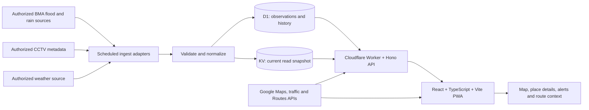

# BKK Flood Live

**Bangkok flood information that is easy to understand when time matters.**

> **Project status: planned.** This repository currently contains the product and technical plan, not a working service. Screens, data feeds, alerts, routes, and deployment described below are targets for the **first full release (v1.0)**. No feature in the v1 scope is being presented as already implemented. The release is not a reduced MVP.

BKK Flood Live is a proposed, independent public information web app for Bangkok. Its goal is to bring flood observations, rainfall, nearby cameras, traffic context, and route context into one clear, mobile-friendly view. It should help people understand *what has been measured, where, and how recently* before making their own travel decisions. It is not an official BMA service, an emergency warning authority, or a guarantee that a road is passable.

## Why build it?

Flood information can be scattered across maps, sensor pages, cameras, weather services, and navigation tools. A map pin alone may leave the most important questions unanswered: Is this a road-flood observation or a canal gauge? Is the reading rising? When was it measured? Is the camera nearby and available? Does a route pass near an observed problem?

The intended difference from a typical flood map is the **decision context around each observation**:

| Common map experience | BKK Flood Live's planned experience |
| --- | --- |
| Pins or layers require the user to interpret several sites | A map-led view connects the selected place with its observation, trend, rainfall, camera, traffic, and source |
| A “live” badge can hide delayed feeds | Measurement time, ingestion time, freshness, and source health are visible |
| A sensor value can look like a road-wide condition | Sensor type, unit, location, coverage, and uncertainty are explicit |
| A route line can imply safety | Nearby flood observations are highlighted with distance and time; the route is never called flood-safe |
| A polished mockup lacks operational depth | Real source adapters, history, failure handling, privacy, tests, and an honest demo mode are part of v1 |

This is also a **portfolio-grade product and engineering project**: the public experience should feel considered and accessible, while the repository demonstrates source evaluation, data modeling, geospatial reasoning, resilient delivery, and transparent limitations. It should remain useful to a nontechnical visitor; portfolio value must not turn the interface into a developer console.

## v1.0: first full release

All rows below are **planned for v1.0**, subject to source access, licensing, and the release gates later in this document. Work may be built in dependency order, but these are not “later” features quietly excluded from the first full release.

| Area | Planned behavior |
| --- | --- |
| Situation overview | Bangkok-wide counts by *verified* status and source coverage, clearly separating normal, watch, flooded, unknown, and offline; last-update summary |
| Map and search | Google Maps base map; clear, distinct markers and layers; road, district, and place search; filters; mobile map with an accessible details sheet |
| Flood observations | BMA road-flood sensors or other authorized official observations where available; measured value, unit, sensor type, trend, history, provenance, and freshness |
| Rain and weather | Authorized BMA rainfall/radar and/or weather source, with source-specific units and time windows; visible “unavailable” state |
| CCTV | Nearby, authorized camera link or embed when permitted; camera location, availability, timestamp where supplied, and a clear unavailable fallback |
| Traffic and routes | Google traffic context and route alternatives when supported; route-adjacent observation analysis, with evidence and uncertainty shown |
| Personal use | Installable PWA, saved places/favorites, current-location lookup only after consent, in-app alerts, and optional browser notifications where supported |
| Trust and operations | Source and system health, freshness/stale states, privacy-respecting analytics, an explicitly labeled demo mode, and a public limitations page |
| Quality and delivery | Responsive and accessible UI, automated and manual tests, performance budgets, CI/CD, staging, monitoring, and documented release gates |

### Core user questions

For any selected observation, answer in this order:

1. **What is known here?** Show the source's actual observation and classification, or “unknown.”
2. **What was measured?** Show value and unit only when the source supplies a meaningful measurement.
3. **Is it changing?** Show a trend only when comparable readings and a defined time window support it.
4. **How recent is it?** Show the source measurement time and the app's last successful retrieval.
5. **What else helps?** Then offer rainfall, traffic, camera, history, routes, and alert actions.

The UI must distinguish a **road-flood measurement** from canal or river level, rainfall, a report, and a camera. A canal gauge must never be relabeled as street water depth. Citywide totals must state their denominator and coverage; missing or offline stations are not “normal.” No example counts or measurements in design mockups represent current conditions.

## Design direction

**Calm emergency information design:** modern, credible public information with a clear hierarchy. Light-first for outdoor/mobile use, map-first, with Thai-readable typography, generous spacing, restrained dividers, and few unnecessary cards. The restraint, spacing, and craft of [changelog.earth](https://www.changelog.earth/) are a mood reference only; its dark terminal/developer styling, ASCII treatment, and dense telemetry layout are not the product UI.

- **Desktop:** the map takes roughly two-thirds of the main view, with one focused detail panel. Avoid sidebars that squeeze the map.
- **Mobile:** a usable full-width map, search, and a bottom sheet for selected-place details. Primary actions remain reachable without covering the map unnecessarily.
- **Visual hierarchy:** status, measurement, trend, and freshness first; supporting context second. Use plain language such as “Updated 4 minutes ago,” with a stale warning when needed, rather than a perpetual “LIVE” indicator.
- **Palette (direction, not final tokens):** warm off-white `#F6F7F5`, white surfaces, deep charcoal `#16202A`, restrained teal `#168C87`. Reserve semantic green, amber, red, blue, and gray for actual data states. Color is never the only carrier of meaning.
- **Type and motion:** readable Thai sans (candidate: IBM Plex Sans Thai or Noto Sans Thai), tabular figures for changing measurements, subtle location/water motifs, and motion that respects reduced-motion settings. No terminal aesthetic, flashing status, or decorative animation that delays useful content.
- **Accessibility target:** [WCAG 2.2 AA](https://www.w3.org/TR/WCAG22/) for the complete experience, including keyboard access, screen-reader names for markers and controls, a list equivalent to map markers, readable contrast, touch targets, focus handling in the bottom sheet, and Thai language/number formatting.

## Proposed architecture



The diagram is a **target design**, not a claim that these integrations exist today. The frontend is proposed as a Vite-built React/TypeScript app hosted on Cloudflare Pages; the API and scheduled jobs use Cloudflare Workers with Hono. The browser renders Google Maps. Server-side Google Routes calls, if used, go through a Worker with restricted credentials and quotas. Provider-specific content and attribution stay separate from the project's own normalized observations.

### Data sources and source gates

Before implementing an adapter, record the exact official endpoint or feed, owner, documentation, license/terms, allowed display/caching, update cadence, units, coordinates, sample payload, failure modes, and contact/escalation path. **The existence of a public map does not imply a stable public API or permission to scrape or rebroadcast it.** BMA flood sensors, CCTV, and rainfall are intended source categories, not confirmed integrations. Weather-source selection must be documented rather than assumed. If a required source cannot be lawfully or reliably used, the v1 product decision and release claim must be revisited explicitly; do not silently replace it with simulated live data.

### Ingestion and normalized model

Proposed source adapters fetch on a source-appropriate schedule with timeouts, bounded retries/backoff, rate limits, and idempotent writes. Normalization validates coordinates and units, preserves raw source identifiers and timestamps, rejects malformed/impossible readings, and records provenance. Store an append-only or deduplicated observation history in **D1**; publish a compact current-state read model in **KV** only after successful validation and persistence. A failed fetch must preserve the last known value **with a stale/unknown state**, never silently make it current.

Core normalized fields are proposed as:

```text
source_id, source_record_id, observation_type, sensor_type,
name_th, name_en?, latitude, longitude, geometry?,
value?, unit?, source_status?, derived_status?,
measured_at?, received_at, published_at?, expires_at?,
quality_flag, provenance_url?, schema_version
```

Separate station metadata, observation records, camera metadata, source health, and derived summaries. Status and trend rules must be defined per observation type and source, tested against representative historical cases, and versioned. Keep raw source snapshots only where permission and retention rules allow.

KV is a **read cache**, not the authority for recent writes: [Cloudflare documents eventual consistency](https://developers.cloudflare.com/kv/concepts/how-kv-works/), including propagation delays. API responses therefore carry `measured_at`, `received_at`, `snapshot_generated_at`, and a freshness state. The history and canonical ingest result live in D1; any freshness threshold must account for the source cadence and KV delay. “Live” must never mean instant or guaranteed complete.

### API and caching

Proposed versioned endpoints cover current observations, place details, history, source status, and route-adjacent observations. Validate query bounds and response schemas, paginate history, add appropriate HTTP caching/ETags, and return explicit partial-data/error states. Limit polling and map requests. Cache **project-owned/authorized observations** according to source rules. Do not put Google route, traffic, or map content into D1/KV or an offline cache unless the applicable [Google Maps Platform policies](https://developers.google.com/maps/documentation/routes/policies) explicitly permit that use; display required attribution and publish Terms of Use and a Privacy Policy before production use.

## Routes and flood-proximity analysis

Google Maps/Routes can provide road geometry, traffic-aware alternatives, and travel estimates according to its [documented routing options](https://developers.google.com/maps/documentation/routes/config_trade_offs). Its [standard route modifiers](https://developers.google.com/maps/documentation/routes/route-modifiers) cover such features as tolls and highways; they are **not a flood-avoidance setting**.

The proposed analysis samples each returned route polyline, finds relevant, recent flood observations within a documented distance of the route, and presents the closest observations with source, measurement type, distance, and timestamp. A proximity match is **a signal to inspect**, not proof that the road segment is flooded. Missing sensors, location error, bridge/underpass geometry, changing conditions, and stale feeds can all change the real situation. Do not call any route “safe,” “dry,” or “flood-free,” automatically exclude a road based only on a nearby sensor, or calculate an unexplained safety score. Only show confirmed closures or flood-specific restrictions if a suitable authoritative source is integrated and the claim is directly supported. When data coverage is inadequate, say so.

## PWA, alerts, favorites, and location

- **PWA:** installable manifest, service worker, and a useful offline shell plus the last permitted project-owned snapshot, plainly labeled with its saved time. Offline data is never shown as current. Respect Google content caching restrictions.
- **Favorites:** save selected places locally by default, with export/reset and clear behavior for removed stations. No account is required in the proposed v1 flow.
- **Location:** ask for browser geolocation only after the person selects “Near me”; use it for that request, do not continuously track or retain precise coordinates by default, and provide manual search as an equal option. Explain any coordinate sent to Google for map or route requests.
- **Alerts:** user-chosen places/areas and thresholds or verified status changes; deduplicate events, show trigger evidence and timestamps, and expose quiet/disable controls. In-app alerts work without browser notification permission. Optional push notifications require explicit opt-in, supported browsers, a minimal subscription store, retention/deletion rules, and separate permission testing. Never promise an emergency warning or delivery time.

## Privacy, analytics, and operations

Collect only data needed to operate the service. Publish a plain-language privacy policy and source/attribution page. Keep favorites and precise location local unless the user explicitly invokes a feature requiring transmission. Do not log raw coordinates, search terms, route endpoints, full URLs/query strings, camera views, or notification payloads in analytics. Use aggregate, low-cardinality events to learn whether map/search/details/route/alert flows work, with clear retention and consent rules. Analytics outages must not block flood information.

Expose a human-readable system-health view: each source's last successful fetch, last measured timestamp, known lag, degraded/offline state, and service incident note. Internal monitoring should track ingest failures, schema drift, stale snapshots, route/API errors, cost/quotas, and notification delivery problems without exposing secrets or personal data. Rate limits, secret management, dependency review, and abuse controls are part of production readiness.

**Demo mode** uses a versioned, synthetic dataset for portfolio walkthroughs and tests. It must be visually and in the URL clearly labeled “Demo data,” isolated from production ingestion, and never mixed into live counts, alerts, routes, or health reports. A demo should demonstrate errors, stale data, and empty states as well as attractive readings.

## Proposed repository layout

```text
apps/
  web/                 # React, TypeScript, Vite, PWA, UI
  api/                 # Cloudflare Worker, Hono routes and scheduled ingest
packages/
  contracts/           # Shared schemas and API types
  data/                # Source adapters, normalization, status/freshness rules
  geo/                 # Route geometry and proximity analysis
  ui/                  # Shared accessible visual components, if justified
db/
  migrations/          # D1 migrations
fixtures/
  demo/                # Clearly synthetic, versioned scenarios
docs/
  sources/             # Source register and permissions
  decisions/           # Architecture and product decisions
  qa/                  # Manual QA and release evidence
.github/workflows/     # CI and controlled deployment
```

This is a proposed structure. Create only packages needed by the implementation; keep source adapters, domain rules, and provider integrations separable so the product can be tested without external services.

## Testing, performance, and delivery

Automated coverage should include schema/contract validation, source fixtures and drift, unit conversion, status/freshness/trend rules, D1 migrations and idempotent ingest, geospatial edge cases, API partial failures, PWA offline/stale behavior, and alert deduplication. Integration tests use provider fakes and approved sandbox credentials. End-to-end flows cover desktop/mobile search, map/list parity, detail, route context, favorites, alert opt-in, and demo isolation. CI checks type safety, lint/format, tests, build, dependency/security checks, and accessible UI checks; deploy staging/preview before a gated production release.

Performance budgets will be measured on representative mid-range mobile devices and constrained networks. Target [Core Web Vitals](https://web.dev/articles/vitals/) “good” thresholds at the 75th percentile where measurable, while also tracking map first-use latency, search response, API p95, map interaction smoothness, bundle size, and provider costs. Use bounded map markers/clustering, lazy camera loading, code splitting, and explicit limits on network polling. Record baselines before setting source-dependent numeric latency SLOs.

Manual QA remains a release requirement: Thai readability and screen readers, keyboard navigation, bright outdoor use, small screens, slow/offline networks, stale and partially failed feeds, real devices/browsers, GPS denial, push permission denial, route uncertainty wording, source attribution, and comparison of displayed readings with their upstream sources.

### v1.0 release gates

1. Source access, display/caching rights, attribution, and Google Maps billing/quotas are documented; required sources are real and monitored.
2. Every v1 feature in the scope table works in production or is explicitly re-scoped through a documented product decision **before** claiming v1.0.
3. Sensor types, units, status rules, timestamps, coverage, and route-proximity limitations are accurate and reviewed against real samples.
4. Stale/offline/partial-source states, demo separation, privacy notices, Terms of Use, and alert permission/retention behavior are verified.
5. CI, migration/rollback, monitoring, accessibility checks, performance measurements, security review, and manual device QA pass with recorded evidence.
6. A final production smoke test confirms data freshness, map/search/details, camera fallback, routes, PWA, favorites, alerts, source health, and incident/fallback messaging.

## Current repository state

At this planning stage there is **no released app, live endpoint, validated feed integration, installed PWA, or passing CI pipeline**. The issue backlog is being drafted for review before any GitHub issues are created.

## Reference documentation

- [Google Routes API traffic options](https://developers.google.com/maps/documentation/routes/config_trade_offs), [route modifiers](https://developers.google.com/maps/documentation/routes/route-modifiers), and [policies/attribution](https://developers.google.com/maps/documentation/routes/policies)
- [Cloudflare Workers KV consistency](https://developers.cloudflare.com/kv/concepts/how-kv-works/), [D1](https://developers.cloudflare.com/d1/), and [Cron Triggers](https://developers.cloudflare.com/workers/configuration/cron-triggers/)
- [WCAG 2.2](https://www.w3.org/TR/WCAG22/) and [Core Web Vitals](https://web.dev/articles/vitals/)

These links document platform capabilities and constraints; they do not verify access to any particular BMA feed.
