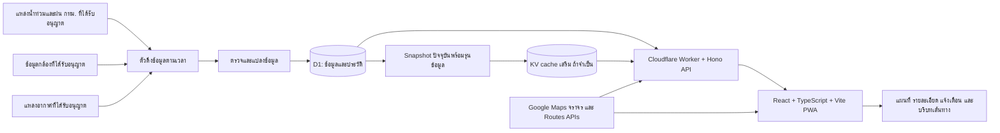

# BKK Flood Live

**ภาษา:** [English](README.md) · ไทย

**ข้อมูลน้ำท่วมกรุงเทพฯ ที่เข้าใจง่ายในเวลาที่ต้องตัดสินใจ**

> **สถานะโครงการ: อยู่ในขั้นวางแผน** ขณะนี้ repository มีแผนผลิตภัณฑ์และเทคนิค ยังไม่มีบริการที่ใช้งานได้จริง หน้าจอ แหล่งข้อมูล การแจ้งเตือน เส้นทาง และระบบเผยแพร่ที่กล่าวถึงด้านล่างเป็นเป้าหมายของ **รุ่นเต็มรุ่นแรก (v1.0)** ไม่ใช่สิ่งที่พัฒนาเสร็จแล้ว และ v1.0 ไม่ใช่ MVP ที่ตัดฟีเจอร์ออกโดยไม่บันทึกการตัดสินใจ

BKK Flood Live เป็นเว็บแอปข้อมูลสาธารณะอิสระสำหรับกรุงเทพฯ มีเป้าหมายรวมข้อมูลการสังเกตน้ำท่วม ฝน กล้องใกล้เคียง สภาพจราจร และบริบทของเส้นทางไว้ในมุมมองที่ชัดเจนและใช้บนมือถือได้ดี เพื่อให้ผู้ใช้เห็นว่า *วัดอะไร ที่ไหน และเมื่อไร* ก่อนตัดสินใจเดินทางด้วยตนเอง แอปนี้ไม่ใช่บริการทางการของกรุงเทพมหานคร หน่วยงานแจ้งเตือนภัยฉุกเฉิน หรือคำรับรองว่าถนนผ่านได้

## ทำไมจึงสร้างโครงการนี้

ข้อมูลน้ำท่วมกระจายอยู่ในแผนที่ เซนเซอร์ กล้อง บริการอากาศ และระบบนำทาง หมุดบนแผนที่เพียงอย่างเดียวไม่ตอบว่าเป็นน้ำท่วมถนนหรือระดับน้ำในคลอง ค่ากำลังเพิ่มหรือไม่ วัดเมื่อไร กล้องยังใช้งานได้หรือไม่ หรือเส้นทางผ่านใกล้จุดที่มีรายงานปัญหาหรือเปล่า

สิ่งที่ตั้งใจให้ต่างจากแผนที่น้ำท่วมทั่วไปคือ **บริบทประกอบการตัดสินใจของแต่ละข้อมูล**:

| ประสบการณ์แผนที่ทั่วไป | ประสบการณ์ที่วางแผนสำหรับ BKK Flood Live |
| --- | --- |
| ผู้ใช้ต้องตีความหมุดหรือชั้นข้อมูลจากหลายเว็บเอง | จุดที่เลือกเชื่อมกับค่าที่วัด แนวโน้ม ฝน กล้อง จราจร และแหล่งที่มา |
| ป้าย “สด” อาจปิดบังความล่าช้าของข้อมูล | แสดงเวลาที่วัด เวลาที่ดึงข้อมูล ความสด และสุขภาพของแหล่งข้อมูล |
| ค่าเซนเซอร์หนึ่งจุดอาจดูเหมือนสภาพของทั้งถนน | บอกชนิดเซนเซอร์ หน่วย ตำแหน่ง พื้นที่ครอบคลุม และข้อจำกัด |
| เส้นทางบนแผนที่อาจชวนให้เข้าใจว่าปลอดภัย | บอกจุดสังเกตน้ำท่วมใกล้เส้นทางพร้อมระยะและเวลา โดยไม่เรียกว่าเส้นทางปลอดน้ำท่วม |
| ภาพตัวอย่างสวยแต่ไม่มีระบบรองรับ | รุ่นแรกต้องมีแหล่งข้อมูลจริง ประวัติ การรับมือเมื่อบริการล้มเหลว ความเป็นส่วนตัว การทดสอบ และโหมดสาธิตที่ระบุชัด |

โครงการนี้เป็น **ผลงานด้านผลิตภัณฑ์และวิศวกรรม** ด้วย แต่หน้าสาธารณะต้องยังใช้ง่ายสำหรับคนทั่วไป ไม่กลายเป็นหน้าควบคุมสำหรับนักพัฒนา

## v1.0: รุ่นเต็มรุ่นแรก

ทุกแถวต่อไปนี้เป็น **เป้าหมายของ v1.0** โดยขึ้นอยู่กับการเข้าถึงแหล่งข้อมูล สิทธิ์ใช้งาน และเกณฑ์ปล่อยรุ่นด้านล่าง อาจพัฒนาทีละส่วนตามลำดับพึ่งพา แต่จะไม่ย้ายฟีเจอร์ออกจากรุ่นแรกโดยไม่บันทึกการตัดสินใจ

| ส่วนงาน | พฤติกรรมที่วางแผน |
| --- | --- |
| ภาพรวมสถานการณ์ | จำนวน **จุดที่มีการติดตามภายในพื้นที่ครอบคลุมของแหล่งข้อมูล** พร้อมตัวหารและเวลาปรับปรุง แยกสภาพที่สังเกตได้จากข้อมูลไม่ทราบค่า ล้าสมัย หรือออฟไลน์ โดยไม่อ้างว่าครอบคลุมทั้งกรุงเทพฯ |
| แผนที่และค้นหา | แผนที่ฐาน Google Maps หมุดและชั้นข้อมูลที่แยกกันชัดเจน ค้นหาถนน เขต และสถานที่ผ่านผู้ให้บริการที่เลือกและมีสิทธิ์ใช้ ตัวกรอง แผนที่มือถือ แผงรายละเอียด และรายการข้อมูลที่ใช้แทนหมุดได้ |
| ข้อมูลน้ำท่วม | เซนเซอร์น้ำท่วมถนนของ กทม. หรือข้อมูลทางการที่ได้รับอนุญาต เมื่อมีให้ใช้ พร้อมค่าที่วัด หน่วย ชนิดเซนเซอร์ แนวโน้ม ประวัติ แหล่งที่มา และความสด |
| ฝนและอากาศ | แหล่งฝน/เรดาร์ของ กทม. และ/หรือแหล่งอากาศที่ได้รับอนุญาต โดยแสดงหน่วยและช่วงเวลาตามต้นทาง รวมถึงสถานะ “ไม่มีข้อมูล” |
| CCTV | ลิงก์หรือภาพฝังจากกล้องใกล้เคียงเมื่อได้รับอนุญาต พร้อมตำแหน่ง ความพร้อมใช้งาน เวลาเมื่อแหล่งข้อมูลมีให้ และ fallback เมื่อใช้ไม่ได้ |
| จราจรและเส้นทาง | บริบทจราจรของ Google และเส้นทางทางเลือกเมื่อบริการรองรับ วิเคราะห์จุดสังเกตใกล้เส้นทางโดยแสดงหลักฐานและความไม่แน่นอน |
| การใช้ส่วนตัว | PWA ที่ติดตั้งได้ สถานที่โปรด การค้นหาใกล้ตำแหน่งปัจจุบันหลังผู้ใช้สั่ง การแจ้งเตือนในแอป และการแจ้งเตือนผ่านเบราว์เซอร์แบบเลือกเปิดเมื่ออุปกรณ์รองรับ |
| ความน่าเชื่อถือและการดำเนินงาน | สุขภาพแหล่งข้อมูล/ระบบ สถานะข้อมูลเก่าหรือขาดหาย analytics ที่เคารพความเป็นส่วนตัว โหมดสาธิตที่เห็นชัด และหน้าข้อจำกัดสาธารณะ |
| คุณภาพและการส่งมอบ | UI รองรับหลายขนาดและการเข้าถึง การทดสอบอัตโนมัติ/ด้วยคน งบประสิทธิภาพ CI/CD staging การเฝ้าระวัง และเกณฑ์ปล่อยรุ่นที่บันทึกไว้ |

### คำถามหลักของผู้ใช้

เมื่อเลือกข้อมูลหนึ่งจุด ให้ตอบตามลำดับนี้:

1. **รู้อะไรเกี่ยวกับจุดนี้?** แสดงข้อมูลหรือการจัดสถานะจากต้นทาง หรือบอกว่า “ไม่ทราบ”
2. **วัดอะไร?** แสดงค่าและหน่วยเฉพาะเมื่อเป็นค่าที่ต้นทางให้มาและมีความหมาย
3. **กำลังเปลี่ยนหรือไม่?** แสดงแนวโน้มเฉพาะเมื่อมีค่าที่เทียบกันได้และกำหนดช่วงเวลาแล้ว
4. **ข้อมูลใหม่แค่ไหน?** แสดงเวลาที่ต้นทางวัดและเวลาที่แอปดึงข้อมูลสำเร็จล่าสุด
5. **มีบริบทอื่นอะไร?** จึงค่อยเสนอฝน จราจร กล้อง ประวัติ เส้นทาง และการแจ้งเตือน

UI ต้องแยก **ค่าที่วัดน้ำท่วมถนน** ออกจากระดับน้ำคลอง/แม่น้ำ ฝน รายงาน และกล้อง ห้ามเรียกระดับน้ำคลองว่าความลึกของน้ำบนถนน ยอดรวมต้องบอกกลุ่มจุดที่ติดตาม ตัวหาร พื้นที่ครอบคลุม และช่วงเวลา จุดที่ข้อมูลหาย เก่า หรือออฟไลน์ไม่ใช่ “ปกติ” จุดเสี่ยงหรือรายงานน้ำท่วมในอดีตเป็นเพียงบริบท ไม่ใช่สภาพน้ำท่วมปัจจุบัน ตัวเลขตัวอย่างในภาพออกแบบไม่ใช่สถานการณ์จริง

## แนวทางออกแบบ

**หน้าข้อมูลสำคัญที่สงบและชัดเจน:** ดูทันสมัย น่าเชื่อถือ ใช้งานกลางแจ้งและบนมือถือได้ดี เริ่มจากแผนที่ ใช้ตัวอักษรไทยที่อ่านง่าย ระยะห่างพอดี และการ์ดเท่าที่จำเป็น ใช้ความเรียบและความประณีตของ [changelog.earth](https://www.changelog.earth/) เป็นเพียงตัวอย่างอารมณ์งาน ไม่ใช้หน้าตา terminal ตัวอักษร ASCII หรือข้อมูลแน่นแบบเครื่องมือสำหรับนักพัฒนา

- **เดสก์ท็อป:** แผนที่ประมาณสองในสามของพื้นที่หลัก และมีแผงรายละเอียดที่โฟกัสทีละจุด
- **มือถือ:** แผนที่เต็มความกว้าง ค้นหาได้ และมีแผงรายละเอียดจากด้านล่าง โดยไม่บังแผนที่เกินจำเป็น
- **ลำดับข้อมูล:** สถานะ ค่าที่วัด แนวโน้ม และความสดก่อน บริบทเสริมตามหลัง ใช้ข้อความอย่าง “อัปเดตเมื่อ 4 นาทีที่แล้ว” พร้อมคำเตือนเมื่อข้อมูลเก่า แทนป้าย “LIVE” ที่แสดงตลอด
- **สี:** พื้นอ่อน `#F6F7F5` พื้นผิวขาว ตัวอักษร `#16202A` และสี teal `#168C87` เป็นแนวทางเบื้องต้น สงวนเขียว เหลืองอำพัน แดง น้ำเงิน และเทาไว้ให้ความหมายของข้อมูล สีต้องไม่เป็นสัญญาณเดียว
- **ตัวอักษรและการเคลื่อนไหว:** ฟอนต์ไทยอ่านง่าย เช่น IBM Plex Sans Thai หรือ Noto Sans Thai ตัวเลขจัดแนวอ่านง่าย และภาพเคลื่อนไหวเบาที่เคารพการตั้งค่าลดการเคลื่อนไหว
- **เป้าหมายการเข้าถึง:** [WCAG 2.2 AA](https://www.w3.org/TR/WCAG22/) รวมคีย์บอร์ด ชื่อที่ screen reader อ่านได้สำหรับหมุด/ปุ่ม รายการข้อมูลที่ใช้แทนหมุดได้ ความต่างสี พื้นที่สัมผัส การจัดโฟกัสของแผงล่าง และรูปแบบภาษา/ตัวเลขไทย

## สถาปัตยกรรมที่เสนอ



แผนภาพนี้เป็น **เป้าหมาย** ไม่ได้หมายความว่าเชื่อมต่อบริการเหล่านี้แล้ว ส่วนหน้าเสนอให้ใช้ React/TypeScript กับ Vite บน Cloudflare Pages; API และงานตามเวลาใช้ Cloudflare Workers กับ Hono เบราว์เซอร์แสดง Google Maps หากเรียก Google Routes จากเซิร์ฟเวอร์ ให้ผ่าน Worker ที่จำกัดสิทธิ์กุญแจและโควตา แยกข้อมูลและเครดิตของผู้ให้บริการจากข้อมูลที่โครงการแปลงเอง ต้องพิสูจน์ความจำเป็นของ KV เทียบกับการอ่าน D1 โดยตรงก่อนเพิ่มระบบอ่านข้อมูลอีกทางที่มีความล่าช้า

### เกณฑ์ผ่านของแหล่งข้อมูล

ก่อนทำ adapter ให้บันทึก endpoint/feed ทางการ เจ้าของ เอกสาร สิทธิ์/เงื่อนไข การแสดงผล การแคชและระยะเก็บข้อมูล รอบอัปเดตและความล่าช้าที่วัดได้ หน่วย พิกัด ตัวอย่างข้อมูล วิธีล้มเหลว และช่องทางติดต่อ ตรวจ **น้ำท่วมถนน, ฝน/เรดาร์/อากาศ และ CCTV** แยกกัน ทดสอบการเข้าถึงและ schema ด้วยข้อมูลตัวอย่าง รวมกรณีไม่มีข้อมูลหรือบริการล่ม

**เว็บแผนที่ที่เปิดสาธารณะไม่ได้แปลว่ามี API ที่เสถียรหรืออนุญาตให้ดึงและเผยแพร่ซ้ำ** ชุดจุดเสี่ยงหรือรายงานย้อนหลังไม่ใช่ข้อมูลน้ำท่วมถนนแบบปัจจุบัน เซนเซอร์น้ำท่วม CCTV และฝนของ กทม. ยังเป็นหมวดข้อมูลที่ต้องตรวจ ไม่ใช่ integration ที่ยืนยันแล้ว หากแหล่งที่จำเป็นใช้ไม่ได้อย่างถูกสิทธิ์และเสถียร ให้บันทึกการตัดสินใจไปต่อ/หยุด และทบทวนคำอ้างของ v1 โดยชัดเจน ห้ามแทนด้วยข้อมูลสาธิตแล้วเรียกว่า live

### การดึงข้อมูลและแบบจำลองกลาง

adapter ดึงตามรอบที่เหมาะกับต้นทาง กำหนด timeout, retry/backoff, rate limit และเขียนซ้ำได้อย่างปลอดภัย ตรวจพิกัด/หน่วย เก็บรหัสกับเวลาของต้นทาง ปฏิเสธค่าผิดรูปแบบหรือเป็นไปไม่ได้ และเก็บที่มา เก็บประวัติแบบ append-only หรือ deduplicate ใน **D1**; เผยแพร่ snapshot ปัจจุบันหลังตรวจและบันทึกสำเร็จเท่านั้น ถ้าดึงข้อมูลล้มเหลวให้คงค่าล่าสุดพร้อมสถานะเก่า/ไม่ทราบ ห้ามทำให้ดูเป็นข้อมูลใหม่

ฟิลด์หลักที่เสนอ:

```text
source_id, source_record_id, observation_type, sensor_type,
name_th, name_en?, latitude, longitude, geometry?,
value?, unit?, source_status?, derived_status?,
measured_at?, received_at, published_at?, expires_at?,
quality_flag, provenance_url?, schema_version
```

แยกข้อมูลสถานี ค่าที่สังเกต กล้อง สุขภาพต้นทาง และสรุปที่คำนวณเอง **สภาพที่สังเกต** เช่น ปกติ/เฝ้าระวัง/ท่วม ต้องแยกจาก **ความพร้อมและความสด** เช่น ปัจจุบัน/เก่า/ออฟไลน์/ไม่ทราบ กำหนดเกณฑ์ ช่วงคำนวณแนวโน้ม หลักฐาน และผู้ทบทวนรายชนิดข้อมูลและต้นทาง หากไม่มีเกณฑ์ที่ป้องกันการตีความผิดได้ ให้แสดงค่าดิบโดยไม่อนุมานสถานะน้ำท่วมถนน ทดสอบกับตัวอย่างย้อนหลังและกำหนดรุ่นของกฎ เก็บ snapshot ดิบเฉพาะเมื่อสิทธิ์และนโยบายการเก็บอนุญาต กำหนด timezone, เวลาต้นทางที่หาย/คลาดเคลื่อน, การย้ายสถานี และรายการที่ซ้ำหรือแก้ไขย้อนหลัง

หากใช้ KV ให้ถือเป็น **cache สำหรับอ่าน** ไม่ใช่แหล่งความจริงของการเขียนล่าสุด เพราะ [KV มี eventual consistency](https://developers.cloudflare.com/kv/concepts/how-kv-works/) เผยแพร่ snapshot ที่มีหมายเลขรุ่นหลังบันทึก D1 สำเร็จ ยอดรวม หมุด และรายละเอียดต้องตามกลับไปยังรุ่นเดียวกันได้ หรือระบุเวลาแยกอย่างชัดเจน API ส่ง `measured_at`, `received_at`, `snapshot_generated_at`, `snapshot_version` และสถานะความสด คำนวณอายุข้อมูลตอนอ่าน เพื่อให้ snapshot ที่แคชไว้กลายเป็น stale ได้แม้ไม่มีการดึงใหม่ D1 เก็บผล ingest และประวัติหลัก เกณฑ์ความสดต้องเผื่อรอบต้นทางและความล่าช้าของ cache คำว่า “live” ไม่หมายถึงทันทีหรือครบทุกจุด

### API และ cache

API แบบมีเวอร์ชันครอบคลุมข้อมูลปัจจุบัน รายละเอียดจุด ประวัติ สถานะแหล่งข้อมูล และจุดใกล้เส้นทาง ตรวจขอบเขตคำขอ/schema แบ่งหน้าประวัติ ใช้ HTTP caching/ETag ตามเหมาะสม และตอบสถานะข้อมูลบางส่วนหรือข้อผิดพลาดพร้อมรุ่น snapshot และขอบเขตข้อมูล จำกัดการ polling และคำขอแผนที่ กำหนด fallback เมื่อ cache ล่าช้าหรือใช้ไม่ได้โดยไม่แสดงข้อมูลเก่าว่าใหม่ แคชเฉพาะข้อมูลของโครงการหรือที่ได้รับอนุญาต ห้ามเก็บเส้นทาง จราจร หรือเนื้อหาแผนที่ของ Google ใน D1/KV หรือ offline cache หาก [นโยบาย Google Maps Platform](https://developers.google.com/maps/documentation/routes/policies) ไม่อนุญาต ต้องแสดงเครดิต และเผยแพร่ Terms of Use กับ Privacy Policy ก่อนใช้งานจริง

## เส้นทางและการวิเคราะห์จุดน้ำท่วมใกล้เส้นทาง

Google Maps/Routes ให้ geometry ถนน ทางเลือก และเวลาการเดินทางตาม [ตัวเลือกการคำนวณเส้นทาง](https://developers.google.com/maps/documentation/routes/config_trade_offs) ส่วน [route modifiers](https://developers.google.com/maps/documentation/routes/route-modifiers) เช่น เลี่ยงค่าผ่านทางหรือทางหลวง **ไม่ใช่ตัวเลือกเลี่ยงน้ำท่วม**

การวิเคราะห์ที่เสนอหาระยะจากข้อมูลน้ำท่วมที่เกี่ยวข้องและยังสดไปยังเส้นเส้นทางที่ได้รับ แล้วแสดงจุดใกล้ที่สุดพร้อมต้นทาง ชนิดข้อมูล ระยะ และเวลา การอยู่ใกล้เป็น **สัญญาณให้ตรวจเพิ่มเติม** ไม่ใช่หลักฐานว่าช่วงถนนนั้นท่วม เซนเซอร์ไม่ครอบคลุม พิกัดคลาดเคลื่อน สะพาน/ทางลอด และสภาพที่เปลี่ยนเร็วล้วนกระทบผล ห้ามเรียกเส้นทางว่า “ปลอดภัย” “แห้ง” หรือ “ปลอดน้ำท่วม” ห้ามตัดถนนทิ้งจากการอยู่ใกล้เซนเซอร์อย่างเดียว หรือสร้างคะแนนความปลอดภัยที่อธิบายไม่ได้ แสดงการปิดถนนที่ยืนยันแล้วเฉพาะเมื่อมีแหล่งทางการรองรับ และบอกเมื่อข้อมูลครอบคลุมไม่พอ

ก่อนพัฒนา ให้เลือกผลิตภัณฑ์ Google สำหรับแผนที่ ค้นหา/แปลงที่อยู่ จราจร และ Routes อย่างเจาะจง พร้อมข้อจำกัดกุญแจ field mask เครดิต โควตา เพดานค่าใช้จ่าย และการทำงานเมื่อบริการล้มเหลว กำหนดรูปแบบการเดินทางกับเงื่อนไขที่มีเส้นทางทางเลือก หาก API ไม่ส่งทางเลือก ไม่ได้หมายความว่าในโลกจริงไม่มีเส้นอื่น วิธีคำนวณระยะต้องระบุชัดและทดสอบเส้นที่มีจุดน้อย สะพาน ถนนขนาน พิกัดหาย ข้อมูลเก่า และพื้นที่ไร้เซนเซอร์ ห้ามส่งต้นทาง/ปลายทางหรือพิกัดแม่นยำเข้า analytics หรือ access log ปกติ

## PWA การแจ้งเตือน สถานที่โปรด และตำแหน่ง

- **PWA:** manifest ที่ติดตั้งได้ service worker และหน้า offline ที่อ่านรายการข้อมูลของโครงการที่บันทึกล่าสุดได้พร้อมเวลาบันทึก รายการต้องใช้ได้เมื่อ Google Maps โหลดไม่ได้ ห้ามแสดงข้อมูล offline ว่าเป็นปัจจุบัน และต้องเคารพข้อห้ามแคชเนื้อหา Google
- **สถานที่โปรด:** เก็บในเครื่องเป็นค่าเริ่มต้น มี export/reset และจัดการเมื่อจุดที่บันทึกถูกลบ ไม่ต้องมีบัญชีใน flow v1 ที่เสนอ
- **ตำแหน่ง:** ขอ geolocation เมื่อผู้ใช้กด “ใกล้ฉัน” เท่านั้น ใช้กับคำขอนั้น ไม่ติดตามต่อเนื่องหรือเก็บพิกัดแม่นยำโดยปริยาย ให้ค้นหาเองเป็นทางเลือกเท่าเทียม และอธิบายเมื่อพิกัดต้องส่งให้ Google เพื่อแผนที่หรือเส้นทาง
- **การแจ้งเตือน:** ผู้ใช้เลือกสถานที่/พื้นที่และเกณฑ์ที่เหมาะกับชนิดข้อมูลหรือการเปลี่ยนสถานะที่ยืนยันแล้ว trigger เฉพาะข้อมูลที่สดและใช้ตัดสินได้ กำหนดรหัสเหตุการณ์ การตัดซ้ำ การแก้ไข/ฟื้นตัว quiet hours ตาม timezone และผลเมื่อแหล่งข้อมูล stale แสดงหลักฐานกับเวลาและมีปุ่มพัก/ปิด การแจ้งเตือนในแอปไม่ต้องขอสิทธิ์ browser notification แต่ต้องระบุว่าตรวจเฉพาะตอนเปิดแอปหรือประมวลผลบนเซิร์ฟเวอร์ด้วย ส่วน push เป็นตัวเลือกที่ผู้ใช้เปิดเอง ต้องมีตารางอุปกรณ์/เบราว์เซอร์ที่รองรับ ที่เก็บ subscription ขั้นต่ำ การลบและระยะเก็บ และทดสอบ permission แยก ห้ามสัญญาว่าจะส่งถึงในเวลาที่แน่นอนหรือเป็นคำเตือนภัยฉุกเฉิน

## ความเป็นส่วนตัว analytics และการดำเนินงาน

เก็บเฉพาะข้อมูลที่จำเป็น เผยแพร่ Privacy Policy และหน้าแหล่งข้อมูล/เครดิตที่อ่านง่าย เก็บสถานที่โปรดและพิกัดแม่นยำในเครื่อง เว้นแต่ผู้ใช้สั่งฟีเจอร์ที่ต้องส่งข้อมูล ห้ามบันทึกพิกัดดิบ คำค้น ต้นทาง/ปลายทาง URL เต็มพร้อม query ภาพกล้อง หรือ payload การแจ้งเตือนใน analytics ใช้เหตุการณ์รวมที่มีจำนวนค่าจำกัดเพื่อดูว่าแผนที่ ค้นหา รายละเอียด เส้นทาง และการแจ้งเตือนทำงานหรือไม่ พร้อมระยะเก็บและหลักเกณฑ์ความยินยอม analytics ล่มต้องไม่ขัดขวางข้อมูลน้ำท่วม

หน้าสุขภาพระบบสำหรับคนทั่วไปแสดงเวลาที่ดึงแต่ละแหล่งสำเร็จล่าสุด เวลาที่วัด ความล่าช้าที่ทราบ สภาพเสื่อม/ออฟไลน์ และบันทึกเหตุขัดข้อง การเฝ้าระวังภายในติดตาม ingest ล้มเหลว schema เปลี่ยน snapshot เก่า ข้อผิดพลาด Routes/API ค่าใช้จ่าย/โควตา และปัญหาส่ง notification โดยไม่เปิดเผยข้อมูลส่วนตัวหรือ secret ต้องมี rate limit การจัดการ secret ทบทวน dependency และป้องกันการใช้ผิดวัตถุประสงค์

ก่อนปล่อยจริง ให้มี **คู่มือรับมือเหตุขัดข้อง**: ใครตรวจค่าผิดและต้นทางล่ม ปิดแหล่งข้อมูลหรือแก้ค่าที่ผิดอย่างไร ผู้ใช้เห็นพื้นที่ที่ข้อมูลเสื่อมอย่างไร และเปิดกลับเมื่อไร ตั้งเตือนค่าใช้จ่ายและ hard quota ของ API ภายนอก ระยะเก็บ/การลบ subscription และ log รวมถึงทางย้อน migration หรือ deployment

**โหมดสาธิต** ใช้ข้อมูลสังเคราะห์ที่มีเวอร์ชันเพื่อแสดงผลงานและทดสอบ ต้องติดป้าย “ข้อมูลสาธิต” ทั้งใน UI และ URL แยกจาก ingestion จริง และไม่ปนในยอดรวม การแจ้งเตือน เส้นทาง หรือรายงานสุขภาพของระบบจริง ควรแสดงกรณีข้อมูลผิด เก่า และว่างด้วย

## โครงสร้าง repository ที่เสนอ

```text
apps/
  web/                 # React, TypeScript, Vite, PWA และ UI
  api/                 # Cloudflare Worker, Hono API และงาน ingest
packages/
  contracts/           # schema และชนิดข้อมูล API ร่วมกัน
  data/                # adapter, normalization, กฎสถานะ/ความสด
  geo/                 # geometry เส้นทางและระยะใกล้เคียง
  ui/                  # component ที่เข้าถึงได้ หากมีเหตุผลให้แยก
db/
  migrations/          # D1 migrations
fixtures/
  demo/                # สถานการณ์สังเคราะห์ที่ระบุชัดและมีเวอร์ชัน
docs/
  sources/             # ทะเบียนแหล่งข้อมูลและสิทธิ์
  decisions/           # การตัดสินใจด้านผลิตภัณฑ์/สถาปัตยกรรม
  qa/                  # QA ด้วยคนและหลักฐานปล่อยรุ่น
.github/workflows/     # CI และการ deploy แบบควบคุม
```

นี่เป็นเพียงโครงสร้างที่เสนอ ให้สร้าง package เท่าที่ใช้จริง และแยก adapter, กฎข้อมูล และผู้ให้บริการออกจากกันเพื่อทดสอบโดยไม่พึ่งบริการภายนอก

## การทดสอบ ประสิทธิภาพ และการส่งมอบ

การทดสอบอัตโนมัติครอบคลุม schema/contract, fixture และการเปลี่ยน schema ต้นทาง, การแปลงหน่วย, กฎสถานะ/ความสด/แนวโน้ม, migration และ ingest ซ้ำ, ความสอดคล้องของรุ่น snapshot, ขอบเขต geospatial, API ที่ข้อมูลขาดบางส่วน, PWA offline/stale และการตัดแจ้งเตือนซ้ำ ทดสอบ integration ด้วย provider จำลองและ sandbox credentials ที่ได้รับอนุญาต E2E ครอบคลุมค้นหาบนเดสก์ท็อป/มือถือ ความตรงกันของแผนที่กับรายการ รายละเอียด เส้นทาง สถานที่โปรด opt-in แจ้งเตือน และการแยก demo CI ตรวจชนิดข้อมูล lint/format test build dependency/security และการเข้าถึง UI; deploy staging/preview ก่อน production ที่มีเกณฑ์อนุมัติ

วัดประสิทธิภาพบนมือถือระดับกลางและเครือข่ายจำกัด ตั้งเป้า [Core Web Vitals](https://web.dev/articles/vitals/) ระดับ “good” ที่เปอร์เซ็นไทล์ 75 เมื่อวัดได้ ติดตามเวลาเปิดแผนที่ครั้งแรก การค้นหา API p95 ความลื่นของแผนที่ ขนาด bundle และค่าใช้จ่ายผู้ให้บริการ จำกัดจำนวนหมุด/ใช้ clustering โหลดกล้องเมื่อจำเป็น แยกโค้ด และจำกัด polling บันทึกค่าตั้งต้นก่อนกำหนด SLO ตัวเลขที่ขึ้นกับต้นทาง

QA ด้วยคนยังเป็นเงื่อนไขปล่อยรุ่น: ความอ่านง่ายภาษาไทยและ screen reader, คีย์บอร์ด, ใช้กลางแจ้ง, จอเล็ก, เน็ตช้า/offline, ต้นทางเก่าหรือล่มบางส่วน, อุปกรณ์/เบราว์เซอร์จริง, ปฏิเสธ GPS/push, ถ้อยคำข้อจำกัดเส้นทาง, เครดิตต้นทาง และเทียบค่าที่แสดงกับข้อมูลต้นทาง

### เกณฑ์ปล่อย v1.0

1. บันทึกสิทธิ์เข้าถึง/แสดง/แคชและเครดิตแหล่งข้อมูล รวมทั้ง billing/โควตา Google Maps; แหล่งที่จำเป็นเป็นข้อมูลจริงและมีการเฝ้าระวัง
2. ทุกฟีเจอร์ในตาราง v1 ทำงานใน production หรือมีการตัดสินใจปรับขอบเขตที่บันทึกไว้ **ก่อน** อ้างว่าเป็น v1.0
3. ชนิดเซนเซอร์ หน่วย กฎสถานะ เวลา ความครอบคลุม และข้อจำกัดของระยะใกล้เส้นทางถูกต้องและทบทวนกับตัวอย่างจริง
4. ตรวจสถานะเก่า/ออฟไลน์/ข้อมูลบางส่วน การแยก demo เอกสารความเป็นส่วนตัว Terms of Use และสิทธิ์/ระยะเก็บการแจ้งเตือน
5. มีหลักฐาน CI, migration/rollback, monitoring, accessibility, ประสิทธิภาพ, security review และ QA บนอุปกรณ์จริง
6. production smoke test ยืนยันความสด แผนที่/ค้นหา/รายละเอียด fallback กล้อง เส้นทาง PWA สถานที่โปรด แจ้งเตือน สุขภาพแหล่งข้อมูล และข้อความเมื่อระบบเสื่อม

## การส่งมอบและโครง issue

ขอบเขต v1.0 ทั้งหมดเป็นเป้าหมายของรุ่นแรก แต่ให้พัฒนาตามลำดับพึ่งพาผ่าน Epic ใน GitHub 4 กลุ่ม: [แหล่งข้อมูลและกฎข้อมูล](https://github.com/Peerapat-J/bangkok-flood-live/issues/1), [แพลตฟอร์มและข้อมูล](https://github.com/Peerapat-J/bangkok-flood-live/issues/2), [ประสบการณ์ผู้ใช้](https://github.com/Peerapat-J/bangkok-flood-live/issues/3), และ[ความน่าเชื่อถือกับการปล่อยรุ่น](https://github.com/Peerapat-J/bangkok-flood-live/issues/4) issue ย่อยต้องบอกการตัดสินใจที่ต้องได้ก่อน สิ่งส่งมอบ เกณฑ์ Done ที่ทดสอบได้ สิทธิ์ต้นทางที่เกี่ยวข้อง และ QA ด้วยคน ผลตรวจสิทธิ์แหล่งข้อมูลและนโยบายผู้ให้บริการเป็น gate ก่อน integration ที่พึ่งพา หากไม่ผ่านต้องมี product decision ไม่เปลี่ยนแหล่งหรือใช้ข้อมูลสาธิตแทนเงียบ ๆ การตรวจอัตโนมัติกับการเทียบบนอุปกรณ์และต้นทางจริงเป็นหลักฐานคนละส่วนในเกณฑ์ปล่อยรุ่น

## สถานะ repository ปัจจุบัน

ในช่วงวางแผนนี้ยัง **ไม่มีแอปที่ปล่อยแล้ว endpoint สด feed ที่ยืนยันแล้ว PWA ที่ติดตั้งได้ หรือ CI ที่ผ่าน** ติดตามงานพัฒนาใน [GitHub Issues](https://github.com/Peerapat-J/bangkok-flood-live/issues); issue ที่เปิดอยู่เป็นงานที่ตั้งใจทำ ไม่ใช่ฟีเจอร์ที่มีแล้ว

## เอกสารอ้างอิง

- [ตัวเลือกจราจรของ Google Routes](https://developers.google.com/maps/documentation/routes/config_trade_offs), [route modifiers](https://developers.google.com/maps/documentation/routes/route-modifiers), และ[นโยบาย/เครดิต](https://developers.google.com/maps/documentation/routes/policies)
- [ความสอดคล้องของ Cloudflare KV](https://developers.cloudflare.com/kv/concepts/how-kv-works/), [D1](https://developers.cloudflare.com/d1/) และ [Cron Triggers](https://developers.cloudflare.com/workers/configuration/cron-triggers/)
- [WCAG 2.2](https://www.w3.org/TR/WCAG22/) และ [Core Web Vitals](https://web.dev/articles/vitals/)

ลิงก์เหล่านี้อธิบายความสามารถและข้อจำกัดของแพลตฟอร์ม ไม่ได้ยืนยันสิทธิ์เข้าถึง feed ของ กทม. แห่งใด
